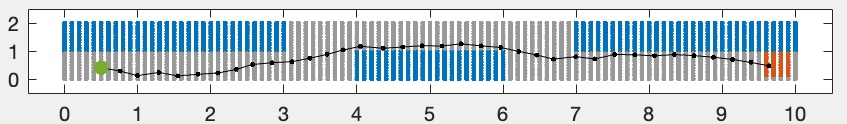
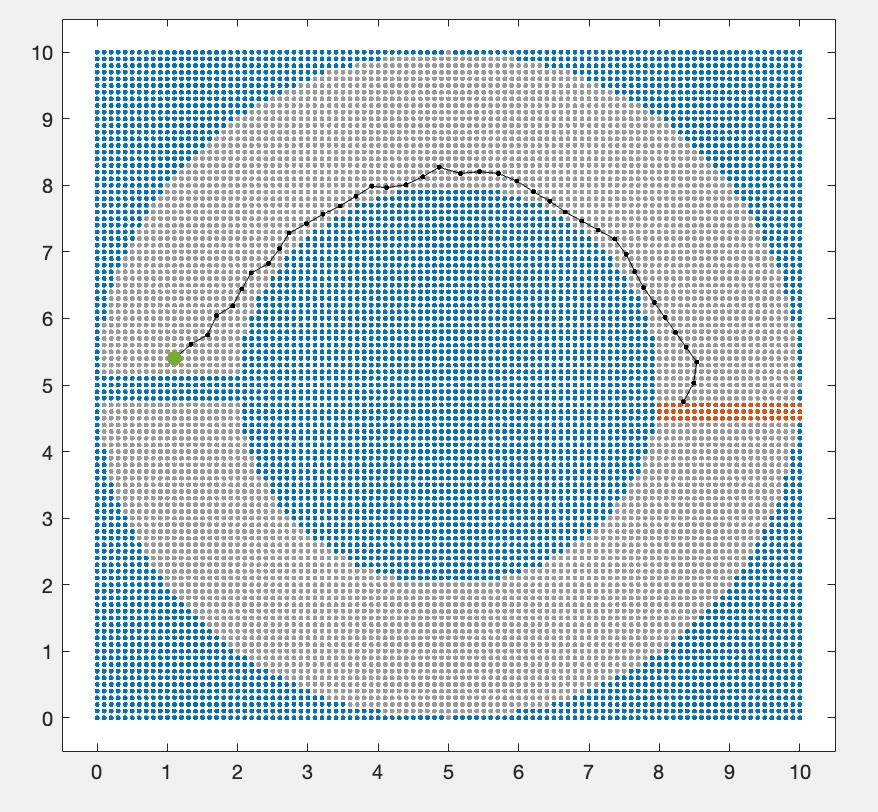

# Vehicle_LaneKeeping_SymbolicControl
Automated lane keeping and obstacle avoidance for vehicles using symbolic controllers

≣ (Symbolic controller based Driver Assistance System)

## Requires [SCOTS](https://github.com/mahendrasinghtomar/SCOTSv0.2_Copy).

---

## The following figure shows the vehicle arena:

* Obstacles shown in blue color
* The grey area denotes the lane for which control values are available, and the vehicle can be steered forward successfully.
* The green dot is and initial point for which the trajectory is shown in black color; target area denoted in red.
* The arena and the controller are generated with: [vehicle_lane.cc](files/vehicle_lane.cc).
* The figure is plotted with: [vehicle_lane.m](files/vehicle_lane.m).

---

## A circular arena:

* The circular arena and controller file: [vehicle_c2.cc](files/vehicle_c2.cc).